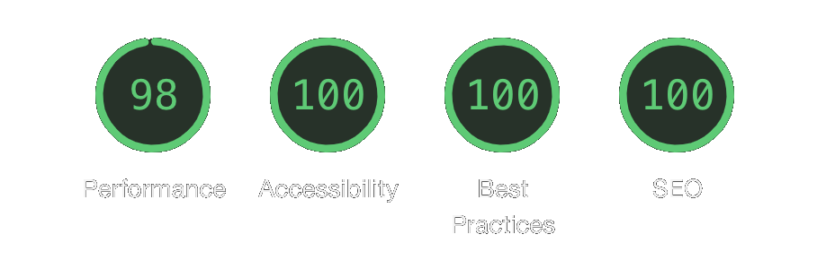

# next-portfolio

The portfolio of **Mutombo Jean-Vincent**, a Full-Stack Software Engineer with 10 years of experience shipping products across Africa, Europe, and the US.

Fast, polished, and built to last. Every decision here has a reason behind it *(yes, even the ones that needed three attempts to get right 😉)*.

<!-- markdownlint-disable-next-line MD033 -->
<p align="center"></p>

---

## 🛠 Tech Stack

| Layer | Choice | Why |
| --- | --- | --- |
| Framework | **Next.js 14** (Pages Router) | Battle-tested, SSR-ready, image optimization built-in |
| Language | **TypeScript 5** | Strict types, zero runtime surprises |
| Styling | **Tailwind CSS v4** | Utility-first with custom theme tokens, no CSS-in-JS overhead |
| Animation | **Motion (Framer Motion v12)** | Physics-based, GPU-accelerated, declarative |
| i18n | **i18next + react-i18next** | Full EN/FR support, locale-aware relative dates via dayjs |
| Theming | **next-themes** | System-preference-aware dark/light mode, zero flash |
| Forms | **react-hook-form + yup** | Schema validation, minimal re-renders |
| Email | **EmailJS** | Contact form with no backend, serverless by design |
| Linting | **Biome** | Replaces ESLint + Prettier in a single fast tool |
| Git hooks | **Husky + lint-staged** | Quality gates enforced before every commit |

---

## 🏗 Architecture

The project follows **Feature-Sliced Design (FSD)**, a scalable frontend architecture that organizes code by feature and layer, not by file type.

```text
src/
├── app/          # Global providers, styles, animations
├── pages/        # Next.js routing (Pages Router)
├── features/     # Self-contained domain slices
│   ├── hero/
│   ├── about/
│   ├── experience/
│   ├── skills/
│   ├── projects/
│   └── companies/
├── layout/       # Shell components: nav, footer, side-menus, tab-bar
└── shared/       # Reusable, domain-agnostic primitives
    ├── config/   # App-wide constants and config
    ├── hooks/    # useScrollReveal, useAnimation
    ├── i18n/     # EN and FR translation files
    ├── lib/      # cn(), throttle, getActiveSection...
    └── ui/       # Design system: buttons, cards, modals, backgrounds...
```

Each feature owns its `data/`, `ui/`, and `index.ts`. Nothing leaks across boundaries.
Think of it as microservices, but without the Kubernetes bill. 💸

---

## ✨ Highlights

- 🌍 **Bilingual** - full EN/FR translation with locale-aware relative dates
- **Scroll-reveal animations** - IntersectionObserver-powered, no library bloat
- **Dynamic modals** - project detail modals are code-split via `next/dynamic` + webpack chunk names
- **Staggered motion** - project cards animate in with index-based delay using Framer Motion variants
- **Spotlight effect** - SVG + feGaussianBlur entrance animation for the hero section
- ✨ **Glowing stars card** - custom canvas-based interactive background for skills
- **Parallax scroll** - multi-column image grid with depth effect in the about section
- **Moving border button** - CSS `@keyframes` + SVG gradient trick for the CTA buttons
- **Contact form** - validated with Yup, submitted via EmailJS, toasts for feedback
- **Zero test files** - `tsc --noEmit` + `next build` are the CI safety net *(the compiler is the test 🤞)*
- **Bundle analyzer** - `yarn analyze` for browser/server split visibility
- **React Scan** - `yarn dev:scan` for live component render profiling

---

## 📄 Sections

1. **Hero** - Intro with typewriter effect, floating stat badges, and dev-tool icons
2. **About** - Parallax photo grid + personal description
3. **Experience** - Vertical timeline: 9 roles across Rwanda, Uganda, Germany, USA, and Denmark
4. **Projects** - Tabbed (Frontend / Fullstack / Mobile / Open Source) with image sliders and live links
5. **Skills** - Tabbed by category (Languages / Frontend / Backend / Infrastructure / Database / Other)
6. **Contact** - Direct message form via EmailJS

---

## 🚀 Getting Started

```bash
# install dependencies
yarn install

# start dev server on port 8070
yarn dev

# type check
yarn type:check

# lint and auto-fix
yarn lint:code:fix

# production build
yarn build
```

---

## 📝 License

MIT - free to use as inspiration, please don't deploy it as your own portfolio.
The recruiter will eventually Google you. 🕵️
